<!-- moved out of README.md on 2026-08-11; see ../README.md#documentation -->

# Architecture

How the board works: the three machines it is made of, what one prediction
actually requires, who runs each piece of it, and how a 512-d embedding becomes
a colour on an LED. Everything here describes the system **as it is**. Why it
ended up this shape, what was tried and rejected, and every number's provenance
are in [`history.md`](history.md); the milestone-by-milestone record is in
[`milestones.md`](milestones.md).

Read it in one pass, in this order: the three chips, then **what one prediction
requires**, then **the decision rule** that turns its output into an answer,
then **who runs each piece**, then how a layer is **cut down to something the
hardware can hold**, then **what happens in what order**, and only then **what
it costs**. The sections after that are reference material for the parts named
along the way — the wire, the block, the fabric, the state machines, the two
cores, and where each of them lives in the tree.

[← back to the README](../README.md) · [building](building.md) ·
[history](history.md) · [dev plan](milestones.md) · [bring-up log](bring-up-log.md)

---

## How it works

**Start here if you have not seen this board before.** Everything after this section, and everything in [`history.md`](history.md), is written on top of the walkthrough below.

### The three machines

| | what it is | its job |
|---|---|---|
| **host** | a Mac on the other end of a USB cable | runs the teacher's text half once per query and sends 512 floats down. Never in the per-frame loop |
| **RP2354A** — *"the MCU"* | 2 × [Arm Cortex-M33](https://developer.arm.com/Processors/Cortex-M33) @ 150 MHz, 520 KB SRAM, 2 MB flash | holds the 768 KB int4 model, drives the camera, walks the network layer by layer, and does everything that is not a matrix multiply |
| **Efinix Trion T8F49** — *"the FPGA"*, *"the T8"* | 7,384 **logic elements** (LE — the unit an FPGA's capacity is counted in), **8** hard 18×18 multipliers, and 15.4 KB of on-chip RAM in 24 five-kilobit **memory blocks**, which everyone calls **BRAM** | one job: multiply int8 matrices, **16 products per clock** — the 8 hard multipliers plus 8 more built out of logic since [M16](milestones.md) |

Both chips sit on one ~$50 board and talk over a **3-bit link**: three data wires and a clock going to the FPGA, **one** wire coming back. That asymmetry shapes every decision below it. This document says **the link** when it means the connection and **the wire** when it means time spent on it — which was 639 of the 851 ms when that split was first measured, and is the reason so much of what follows is about the wire.

### One inference, end to end

1. **Once per query, on the host.** You type `a person smiling`. The host runs the teacher's real text tower and sends the resulting **512-d embedding** — 512 floats locating that phrase in the teacher's shared image/text space — to the board over USB. *Which* teacher is read off the export the board was flashed from, not chosen here; [M18](milestones.md#m18--the-teacher-swap-and-a-guard-for-a-mistake-that-does-not-look-like-one--2026-08-10-shipped-and-bit-exact-on-the-board-the-guard-fired-and-was-broken-until-it-did-and-one-real-book-opened-then-closed-ranks-the-way-the-swap-was-for--by-242-sd-on-the-difference-axis-from-040-of-the-frames) says why that had to stop being a constant.
2. **Once per frame, on the MCU.** A 128 × 128 × 3 image arrives from the camera.
3. **Eight convolutions.** The **student** — a small CNN trained to imitate the teacher's *image* tower, 1.40 M int8 parameters — is eight stages of 3 × 3 convolution. The MCU runs them one at a time, in order.
4. **Each layer is cut into blocks.** The **tile** — this project's name for the multiply engine in the FPGA — holds 2,048 running totals and a 2 KB slice of input, so no whole layer fits in it. A **block** is one chunk of a layer's output — `P` output positions × `Q` output channels. A frame is **174 blocks**.
5. **Each block is computed in passes.** A block usually needs more input channels than the tile's weight buffer holds, so it is swept in **passes** of `Cb` input channels, accumulating as it goes. A frame is **1,856 passes**, 10.67 per block.
6. **Each pass is three commands over the link.** `ACT` sends the input slice, `WGT` sends the weights, `RUN` clocks the tile while it multiplies. `RUN` carries no data in either direction and is still the single largest item in the frame — that is the central fact about this board.
7. **`DRAIN` brings the block back.** After the last pass the tile's int32 accumulators return over the 1-bit line.
8. **The MCU finishes the layer.** It **requantizes** each int32 down to int8 and writes it where it belongs in the output tensor — the **scatter**. That tensor is the next layer's input; back to step 4.
9. **After the eighth layer**, still on the MCU: average-pool the 4 × 4 × 256 output down to 256 numbers and put them through one 256 → 512 linear layer. That is the image's own 512-d embedding, in the same space as step 1's — un-normalized, deliberately; step 10 does that in float.
10. **Decide.** Cosine similarity against each of up to six query vectors, standardized against the background this room reads at, turned into a nearest-reference answer and a distance that says whether to trust it, and reported on the RGB LED. That last step is a subsystem rather than a threshold; it is [its own section](#from-the-embedding-to-an-answer) below.

**Steps 2 through 10 all run on the board, and steps 3 through 9 are the inference.** Step 1 runs on the host, once per *query* rather than once per frame; step 2 is an ArduCam Mega 3MP over SPI, fitted since M8b and required — `m9.c:1592` refuses to start the demo without one; step 10 is a handful of dot products and some arithmetic on six numbers.

**The appliance's own frame is 282 ms at 320/160**, of which steps 3–9 are **265 ms** and step 2's burst read is **16 ms**. Step 2's *exposure* costs nothing, which is the point of the paragraph below. The rest is step 10 plus what a demo does that a harness does not: hold a background, standardize against it, and print a line per frame down the CDC.

**That is a sum of measured parts, and the board also times the frame with a clock: 293 ms.** Every ms/frame this project published before 2026-08-15 was the sum alone, and a sum of parts is exactly the thing an overlap can flatter by moving work out of the parts instead of out of the frame — so `m9` now accumulates the interval between successive frames as well and prints both. The 11 ms between them is step 10, the LED and the CDC line: real, and named by neither of the three parts.

**The frame used to be 420 ms, and what removed the difference was not the clock.** Across 280, 300, 320 and 332 MHz the inference is 400 / 374 / 350 / 338 ms — perfect 1/f — while the whole frame was 454 / 455 / 420 / 420. It landed on a grid about 34 ms wide, one frame of a ~29 fps sensor: `cam_capture()` triggered and then stood still until CAP_DONE, and the sensor finished on its own boundary. Anything that got faster inside one cell of that grid bought nothing at all.

So [#10](https://github.com/kazunori279/fpga-open-vocab/issues/10) overlapped the capture with the compute instead. `cam_capture()` splits into `cam_trigger()` and `cam_collect()`, and `ft_capture()` triggers the *next* frame before returning, so the sensor reaches its boundary underneath the encoder and the collect finds CAP_DONE already asserted. Measured back to back on one boot, one build and one scene — `m9`'s `'O'` key flips it at runtime, because two builds would differ in more than the overlap:

| by the clock | encode | waiting for the sensor | burst | frame | shutter to LED |
|---|---|---|---|---|---|
| serial | 346 ms | 55 ms | 16 ms | **429 ms** | 435 ms |
| overlapped, trigger at the collect | 346 ms | 0 ms | 16 ms | **373 ms** | 725 ms |
| overlapped, trigger late | 346 ms | 0 ms | 16 ms | **373 ms** | 494 ms |

It costs no memory — the frame waits in the ArduChip's own FIFO rather than in the 132 KB pool — and it costs latency, which is the fourth column and was not measured until [#14](https://github.com/kazunori279/fpga-open-vocab/issues/14) added it. The first overlap armed the camera the instant it collected, a whole encode before the pixels were needed: 56 ms of frame time bought at 290 ms of staleness. Nothing in the tree reported freshness, so that price never appeared anywhere.

**The trigger now goes out late instead.** `frame.c` keeps the previous frame's per-layer timings and arms at the end of whichever layer leaves less than a *lead* of compute still to run. The lead cannot be a constant — it is mostly exposure, and exposure is the room's to decide — so it is a feedback loop off the wait `cam.h` already measures: raise it on a single wait, decay it after eight clean frames. In a lit room it settles around 95 ms and in a dim one around 128 ms.

Same throughput to the millisecond, 231 ms fresher. What is left of the trade is 59 ms, and that is the exposure itself. Those three rows were measured at the 346 ms encode the appliance had at the time; the paragraph below then took the encode itself apart, and the shipped latency is now **390 ms**.

**Then the split that [#14](https://github.com/kazunori279/fpga-open-vocab/issues/14) asked for found a line that was never switched on.** There was no per-actor breakdown of the encode at the rate the appliance ships at — the only one in the tree is M7i's 851 ms frame, at 8 MACs and a 75 MHz link. Putting 320000 on top of `m7`'s clock ladder produced one, because `m7` rung 5 is byte-identical to `m9`'s engine mode and `m7` already prints every actor. It also produced the finding: `ft_set_rq()` — M15's **tile-side requantize epilogue**, where the tile rounds and clamps each accumulator itself and `DRAIN` returns one byte instead of four — was called in `m7.c` and nowhere else. `m8` and `m9` had been draining int32 since M15 shipped. Nothing argued for it; the appliance was simply never moved over, and with no breakdown at the shipped rate the cost never surfaced anywhere. One boot of `m7`, configuration C at 320/160, bit-exact both ways:

| | frame | `DRAIN` | bytes on the wire | decode behind core 0 | core 1 busy |
|---|---|---|---|---|---|
| int32 accumulators | 349 ms | 72 ms | 13.259 MB | 66 ms | 225 ms (65%) |
| codes (`ft_set_rq`) | **270 ms** | **19 ms** | **10.244 MB** | **17 ms** | **149 ms (55%)** |

On the appliance that is **373 → 293 ms** by the clock and **464 → 390 ms** shutter to LED, from one line. It is safe by construction rather than by assertion: `probe()` runs the whole test vector through the tile in this mode at start-up and refuses to run the demo unless all 512 embedding floats match `encoder_fast` — 512/512, in 269 ms. The accumulator sweep that guards the MAC array is unaffected, since a sweep pass overrides the mode back to int32.

Where the remaining 270 ms goes, at 320/160, config C, whole frame: the wire is 202 ms elapsed and 10.244 MB in 6,295 transactions, of which `RUN` **103 ms**, `WGT` 42, `ACT` 35, `DRAIN` 19, `NOP` 1, `CFG` 1; staging 27 ms, locate 26, decode 5, CRC 2. Core 1 is busy 149 ms and core 0 stalls 5. **`RUN` is 38% of the frame and it is the only actor that is arithmetic** — everything else is moving bytes to feed it.

**And with the grid gone, the clock sweep that chose 320 was worth re-running.** It had rejected 332 for measuring the same 420 ms as 320, which is exactly the tie the grid manufactures. Four rates, 150 frames each, one image per rate differing in `FGX_SYS_KHZ` alone ([#13](https://github.com/kazunori279/fpga-open-vocab/issues/13)):

| sys / link | encode | frame by the clock | shutter to LED |
|---|---|---|---|
| 280 / 140 | 303 ms | 331 ms | 414 ms |
| 300 / 150 | 283 ms | 310 ms | 403 ms |
| **320 / 160** | **265 ms** | **291 ms** | **377 ms** |
| 332 / 166 | 256 ms | 281 ms | 379 ms |

`encode × f` is 84,840 / 84,900 / 84,800 / 84,992 — **1/f to within 0.2%** — and the whole frame now tracks it as well, with about 10 ms of LED and CDC line that does not scale with anything. The old sweep's 454 / 455 / 420 / 420 was the sensor, from end to end. (The 320 row here is this sweep's own 150-frame run, so it reads 291 against the 293 of the 300-frame soak quoted above — the same rate measured twice, two frames apart.)

**332 is bit-exact and it is not what ships.** `m7` passes all six modes of both link configurations at 332/166 and `m9` ran 151 of 151 good, so this is a margin decision rather than a measurement: 332 buys 3.4% and sits 8 MHz below 340, where the link stops answering entirely and deterministically. [#9](https://github.com/kazunori279/fpga-open-vocab/issues/9) (the board drops off USB) and [#12](https://github.com/kazunori279/fpga-open-vocab/issues/12) (a byte lost on the camera bus at 280/140 and never at 150/75) are both open, both are unexplained flakiness on the fast side, and one 320 run in this very session dropped off USB. 10 ms does not buy out a margin those two have not finished asking about.

**What those two have said since (2026-08-15).** Both now leave evidence instead
of a gap in a log. The camera bus keeps a worst-gap high-water mark, and the
number is a margin rather than a fault count: **16 µs against the 2,000 µs
deadline over 152 frames at 280/140**, and 15 µs over 101 frames at 320/160.
Whatever #12 is, it is not the bus gradually running out of time on the fast
side — the two rates measure the same, and 125× clear. USB is now watched from
the board rather than inferred by the host afterwards: `usb_hw->sof_rd` going
still for a second counts as an outage even when TinyUSB still believes it is
mounted, which is what the two real outages in this session looked like. The
board re-attaches itself, prints how long it was gone and which frames it lost,
and after 30 s of no bus it reboots deliberately and says so in the next banner.
A **third shape** turned up while doing it — a run that vanished and came back
with a fresh banner, no `hang :` and no `usb :`, so nothing above the firmware
had rebooted it — and the banner now prints `POWMAN_CHIP_RESET`'s `HAD_*` bits
against a copy kept in watchdog scratch, which separates a brown-out or a supply
glitch from a watchdog reboot instead of leaving them indistinguishable.

**And the first real outage the instruments were on for said the escalation is
not a recovery** (2026-08-16, frame 1,987 of a 3,000-frame soak). D1 went dark,
which the LED only does if the loop stopped rather than froze, so the reboot
fired — and the hub still read `power` with no `connect` until `uhubctl` cut
VBUS. That looked like the USB block surviving a chip reset, or the hub port
latching, and it was neither: **the escalation was not failing, the flash was**.
GPIO0 is the APS1604M PSRAM's chip select, on the same QSPI bus as the
in-package flash, and `PADS_BANK0_GPIO0_RESET` has the pull-down on — so with no
`hardware_psram` linked and nothing else touching the pin, U1 sits selected for
the whole run and eventually drives `SD0..3` against the flash. XIP dies
instantly, which is what D1 going dark actually measures; the watchdog fires on
time; and the bootrom cannot read the image either, so it falls to USB boot or
hangs before the pull-up goes back up. Only cutting VBUS clears it because only
that power-cycles U1. `m9`'s `main()` now parks GPIO0 high first thing:
**15,008 frames over five 3,000-frame soaks with zero outages**, against one
completion in five before. The bring-up log has the diagnosis, the two soaks
that excluded the clock and the rail, and what is left of
[#9](https://github.com/kazunori279/fpga-open-vocab/issues/9).

The same event exposed a limit of the reporting that still stands: stage, frame
and the `CHIP_RESET` copy all live in watchdog scratch, and scratch does not
survive the power cycle that is the only recovery — so an outage that ends in
`uhubctl` cannot be attributed by the board at all. `host/usb_watch.py` is the
answer for now, logging the hub port from outside the reset; last words in a
flash sector are what would let the board answer for itself.

---

## The board, as actually wired

Extracted from the vendor's **KiCad source** with [`tools/kicad_netlist.py`](../tools/kicad_netlist.py), cross-checked against the [Efinity](https://www.efinixinc.com/products-efinity.html) pinout report, the [JLCPCB](https://jlcpcb.com/) BOM and the loader firmware. Full detail in **[`pinmap.md`](pinmap.md)**. Several things the product page implies are **not** true.

One idea recurs below and is worth having up front. The T8 has no configuration flash of its own, so at power-up it waits in **SPI-passive configuration** mode for something else to shift a bitstream into it — here, the MCU. Once the FPGA raises `DONE`, the three pins that carried that bitstream revert to ordinary user IO. **Those three pins are the link.** There is no second connection between the chips; the dataplane is the configuration port, reused.

| | |
|---|---|
| **MCU↔FPGA dedicated link** | `FPGA.CS`/`CLK`/`MOSI` on RP2354 GPIO1–3 → T8 `GPIOL_01_SS_N` (G3) / `GPIOL_02_CCK` (F3) / `GPIOL_04_CDI0` (F2), plus `nRESET`/`DONE`/`nSTATUS` on GPIO4/5/6. **No MISO.** This is the Trion SPI-passive *configuration* port. All three data pins revert to user IO after `DONE`, so it doubles as a **3-bit contiguous** dataplane — and that is the widest one available. |
| **RP header pins** | Only **6**: PIN0/1 = GPIO8/9, PIN2/3 = GPIO22/23, PIN7/8 = GPIO12/13. Three isolated pairs. |
| **FPGA header pins** | **18**: PIN4–6, PIN9–23. Banks 2A × 7, 2B × 5, 1A × 4, 1B × 2. |
| **Unreachable RP GPIO** | 7, 10, 11, 14–16, 18, 20, 21, 24–27 have **no pad anywhere** on the board. |
| **Shared pins** | **None.** MCU and FPGA occupy disjoint header pins. |
| PSRAM | **Fitted by accident; unusable, and officially untested.** U1 ([APS1604M](https://www.apmemory.com/products/qspi-psram/), 2 MB, QMI second CS on **GPIO0**) is soldered on the **underside** — visually confirmed 2026-07-30 — and wired to the QMI exactly as the RP2350 XIP-PSRAM reference does. M5c read its ID off the wire: AP Memory, known good die, **2 MiB**. But the reply arrives 18 bit-times out of frame, so `psram_detect_size()` returns **0** and M5/M5b ran from flash. Reproduced on **both boards** with different dies, host driver cleared. **Adiuvo confirmed 2026-07-30 that U1 was never intended to be populated and has never been tested** — treat it as absent ([#10](history.md#verify-before-building)). Ignore the `dnp` flag on U1 in the `.kicad_pcb` too: it does not describe this board either |
| FPGA clock | Y2 `ECS-2520MV` = **32 MHz** into `GPIOL_20_PLLIN` (B4), OE gated by `FPGA.OSC_EN` = **GPIO19** (active high), R6 = 1 MΩ pull-down — the oscillator is **off** until the MCU enables it |
| Config straps *(a **strap** is a pin whose level at power-up selects a mode instead of carrying data — get one wrong and the chip comes up in the wrong configuration, or not at all)* | `CRESET_N` and `SS_N` both have **10 kΩ pull-downs**: the FPGA is held in reset until the MCU releases it, and the board is hard-strapped to **passive** SPI configuration. `CBUS[2:0]` (PIN5/6/9) pulled up = x1. |
| FPGA-side extras | RGB LED (E1/F1/G1, common anode, active low), push button SW1 on **G6 = `CSO`** — none on header pins |
| Config flash | **None, and nowhere to add one.** The FPGA cannot self-boot; the MCU is the only config path. |
| Buttons | No BOOTSEL or reset *button*. The **`PRG` and `GND` pads on the short bottom edge** are the BOOTSEL strap — shorting them while plugging in mounts `RP2350`. **Confirmed working**, and since 2026-08-03 no longer the only path: `picotool reboot -f -u` reaches BOOTSEL over USB with nothing touched (see [question 9](history.md#verify-before-building)). Note the strap is *not* the silkscreen `17`/`18` pads on the long row, which go to FPGA balls B3/B7 and cost two failed attempts. |

**Two consequences that shape the whole project:**

1. **The MCU↔FPGA link tops out at 3 contiguous bits.** GPIO1/2/3 are the only contiguous run wired to the FPGA, and no jumper can extend it: the RP's six header pins form three isolated pairs, and every GPIO that would bridge them is unbonded. [**PIO**](https://datasheets.raspberrypi.com/rp2350/rp2350-datasheet.pdf) is the RP2350's programmable IO coprocessor: eight tiny state machines that toggle pins on their own schedule, which is how a 150 MHz CPU drives a 75 MHz link without spending its own cycles on it. A PIO state machine can only drive a **contiguous** run of pins, so the planned 8-bit parallel dataplane **cannot be built on this board** — see [Bus rate](#bus-rate). What *one* jumper can do is move the link clock out of those three bits onto FPGA ball B3, so all three carry data; the clock does not need to be contiguous with them, because PIO's side-set base is a separate register from its `out` base.
2. Bank spread is *not* the problem it first looked like. Bank 2A alone carries **7** FPGA header pins, so a wide camera-side bus can stay in one bank. The constraint is on the MCU side, not the FPGA side.
---


Everything below describes the system that exists and has been measured, in configuration C, as of 2026-08-03. **An inference frame took 851 ms then and takes 350 ms now** — M16, the two clock audits, M17 and the move to 320 MHz all landed after this section was written, and the *shape* is what they left alone. The structure below is current; every absolute millisecond in it is the 2026-08-03 measurement and is labelled where it appears, because re-deriving the per-actor split at the shipped 320/160 needs a profiling run that has not been done. Where the two disagree, [Status](history.md#status-and-roadmap) is right. The frame is bit-exact against the plain-C reference in every **mode** tested — a mode being one selectable code path inside a single firmware binary, six of them today, so that any two of them can be compared in the same boot rather than across a reflash. How it got there is in [`milestones.md`](milestones.md); this section is only the shape it ended up.


## The shape of the thing

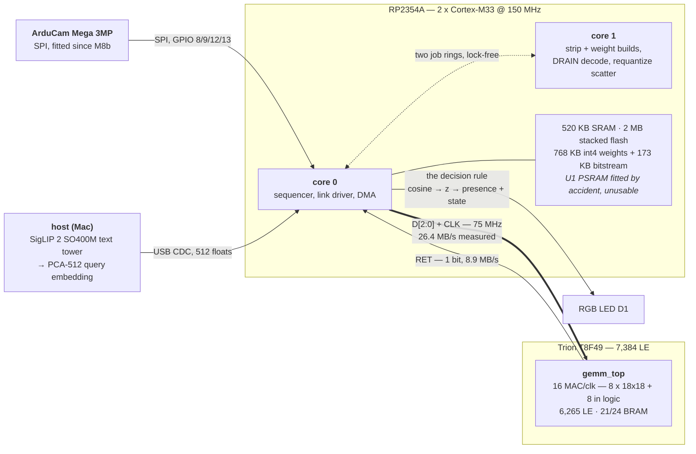

Both chips are on **one ~$50 board**. The only dataplane between them is the Trion's SPI-passive *configuration* port, reused as user IO after `DONE`, plus one soldered jumper that moves the clock off it — everything else on the header is reset, status and the oscillator enable.

`gemm_top` is the entire FPGA design, and it has three parts, all named again later: **`gemm_link`** speaks the wire protocol, **`gemm_tile`** is the multiply engine — the *tile* — and **`im2col_feed`** sits between them turning a 3 × 3 convolution into something the tile can eat. The figure's `21/24 BRAM` is the interesting number: memory, not logic, is what this design runs out of.

Four things about that picture are load-bearing, and each of them was forced rather than chosen:

- **The text tower never runs on the device.** The host encodes the query with the real teacher and pushes 512 floats over USB; on-device prediction is one dot product. The T8 could not hold a transformer and the RP2354A could not run one at any useful rate.
- **Weights are resident on the MCU side, not streamed.** 768 KB of int4 in the 2 MB stacked flash, fetched over **XIP** — execute-in-place, where the CPU reads flash as if it were ordinary memory and a small cache absorbs the difference. U1 (2 MB PSRAM) is fitted but was populated by accident and has never been tested by the vendor — treat it as absent.
- **The link is 3 bits out and 1 bit back**, and cannot be widened in either direction. That asymmetry is why the FPGA is fed activations and weights and asked for a much smaller answer, rather than used as a coprocessor per operation.
- **The MCU is the tile's only clock.** There is no oscillator driving `gemm_top` except `LINK_CLK`, so every cycle the tile computes is a cycle core 0 spends toggling a pin. That single fact sets the frame's floor; see below.

## The student, and what one prediction needs

Start with the arithmetic, because everything after this section is a consequence of it.

`model/student.py` **distills** a **teacher**'s image tower — a transformer orders of magnitude too large to run on this board — into a **student** of **1.40 M parameters and 159 MMAC**, under a 1.5 M / 250 MMAC budget. Distillation here means the student is trained to reproduce the teacher's 512-d output vector on the same images, rather than trained on labels; what it inherits is the teacher's embedding space, which is the thing the text side needs it to share. M4 measured that it retains **94%** of the queries CLIP itself gets right.

**Which teacher changed at M18**, and it is the one architectural fact worth carrying into everything below. CLIP ViT-B/16 reads a query as a bag of words — it ranks *"an opened book"* above the closed one, and so did the student that inherited it. The teacher is now **SigLIP 2 SO400M**, whose 1152-d output is squeezed to the board's 512 by a **frozen PCA** fitted once and shipped as part of the recipe. Retention costs 3 points (**91%** at int4) and the open/closed axis gains 10 sd. Nothing on the device changed: it is the same 1.40 M parameters emitting the same 512 floats into a different space.

**And that is a trap worth naming here.** Both spaces are 512-d, so a query encoded by the wrong teacher produces a perfectly well-formed number that means nothing — no exception, no NaN. The countermeasure is in two places: `model/export.py` writes an `export.json` naming the space beside the weights, and the board prints a crc32 of the weights it is actually running so the host can refuse to talk to a stale flash.

```mermaid
flowchart LR
  IMG["frame<br/>128 x 128 x 3"] --> PRE["<b>quantize</b><br/>normalize to [-1,1],<br/>÷ in_scale, round,<br/>clip to ±127 → int8 CHW"]

  subgraph CONV["8 conv stages — nconv = nlayer - 1"]
    direction LR
    L1["32<br/>s2, 64²"] --> L2["64<br/>s2, 32²"] --> L3["64<br/>s1, 32²"] --> L4["128<br/>s2, 16²"]
    L4 --> L5["128<br/>s1, 16²"] --> L6["192<br/>s2, 8²"] --> L7["192<br/>s1, 8²"] --> L8["256<br/>s2, 4²"]
  end

  subgraph HEAD["pool and head — fgx_pool_head()"]
    direction LR
    P["global average pool<br/>4 x 4 x 256 → 256 floats"] --> PQ["quantize<br/>÷ head_in_scale → uint8"]
    PQ --> H["linear 256 → 512<br/>131 KMAC"]
  end

  PRE --> L1
  L8 -->|"float, not codes"| P
  H --> E["512-d embedding"]
  E --> DOT["L2 normalize → cosine vs each query<br/>→ z → presence + state → LED"]
```

**Every conv stage is the same three operations** — a 3 × 3 convolution with padding 1 and no bias, batch normalization, then ReLU. **The batch norm is folded into the convolution's weights at export time**, which is a standard trick and matters here for exactly one reason: the hardware then only ever sees a plain 3 × 3 int8 convolution, and needs no logic for anything else.

So one frame needs precisely four kinds of work, and it is worth naming them separately because they end up in three different places:

| | what it is | how much |
|---|---|---|
| **quantize the input** | the image is normalized to [-1, 1], divided by `in_scale`, rounded and clipped to ±127. `conv0` is the only stage that sees *signed* input; every later stage reads the 0..255 codes the stage before it emitted | once per frame |
| **the multiply** | `acc[c] = Σ x·w` over the nine taps and `Cb` input channels, **int32** | 159 MMAC |
| **the epilogue** | `(acc + bias) · mult`, ReLU, and — for stages 0..6 — round and clamp to a 0..255 code. `bias` is already in accumulator units and `mult` already folds dequantize and requantize together, both precomputed by `model/export.py`, so nothing at runtime knows a scale | 356,352 output elements |
| **pool and head** | average the 4 × 4 × 256 down to 256 floats, quantize with `head_in_scale`, then one 256 → 512 linear | 131 KMAC |

Two details of that table are load-bearing later. **The accumulator is int32 and must stay int32** — it is the one value the FPGA is checked against, and C will silently widen it the moment an `int64` creeps into the expression. And **`conv7` emits float rather than codes**: its output is only 4 × 4 × 256, so keeping it in float costs 16 KB and avoids quantizing immediately before an average pool that would wash the codes out anyway.

**The head does not normalize.** `ft_pool_head()` leaves a raw 512-d float vector — `encoder.h:107` says so in as many words, *"NOT L2-normalized (that is the caller's job, in float)"* — and the caller folds the normalization into the comparison instead: `cosine()` at `m9.c:755-766` divides by both magnitudes, so the query side, which arrives unit-length, and the image side, which does not, are treated identically and nothing depends on which. Everything measured in the sections below is steps 2 through 9 of [one inference, end to end](#one-inference-end-to-end); step 10 is next.

## From the embedding to an answer

The nine steps above produce a number the board cannot act on. A cosine of 0.27 between the frame and `an open hand` says nothing on its own: 0.27 is a large number for one phrase and a small one for another, this room reads differently from the dataset the calibration came from, and a device pointed at a desk for an hour will drift through more than the difference it is being asked to detect. Everything between the embedding and the LED exists to turn that cosine into a verdict, and it is the part of the design that took the longest to get right — M9 through M21, with two rules retired along the way.

Source of truth for all of it is [`../firmware/m9.c`](../firmware/m9.c), which is the demo firmware and where every constant below lives.

**One: the cosine.** Up to six query vectors (`FGX_MAX_Q` is 6) sit in `qvec[]`, pushed from the host over USB. Each frame the board takes the cosine of the embedding against each of them, normalizing both sides (`m9.c:755-766`).

**Two: the z-score.** The reported score is not the cosine but

```
z[i] = (cos[i] − qbg[i]) / bg_spread(i)
```

`zscore()`, `m9.c:414-421`. Both terms are learned **in this room**, and that is the substance of the step rather than a refinement of it. COCO's negatives are the wrong background for a device that only ever looks at one place: across five bench scenes — a blank whiteboard, a book's back cover, its front cover, a wine glass, a covered lens — the query `laptop` led every one of them, on the raw cosine, because the mean of COCO's laptop-negatives is taken over fields and food and dogs while every frame this camera has ever taken is an indoor desk in front of a window. The residue is a property of the room, and the room is the only place it can be measured (`m9.c:234-248`).

So the board measures it. `bg_update()` (`m9.c:447-460`) keeps a running mean of each query's own cosine, plus a Welford `M2` for its spread, and then does one of two things:

| `bg_hold` | behaviour | right for |
|---|---|---|
| **true** *(default)* | learn for `bg_tau` frames, then **freeze** | a fixed installation asking *"has this state appeared, and is it still there"* |
| false | plain running mean for `bg_tau` frames, exponential forever after | a demo where things are held up and taken away |

A running mean measures *change*, not presence: leave the same book in front of the lens and under `bg_hold = false` it becomes the background and its score decays toward zero, which — once M11 put the score on the LED — looks exactly like a bug. Hence the default, and hence the short default window: `FGX_BG_TAU_DEFAULT` is **30** frames (~27 s), because under hold `bg_tau` is a warm-up length rather than an averaging window and whatever is in shot while it runs is what gets frozen in as furniture. `'N'` on the console forgets the room and learns it again. `bg_tau = 0` with hold is legal and means "no bench background at all" — `qmu` from the export stands forever, which is the pre-M12 behaviour and a useful control.

Three flags, all set by `demo.py` by default, ride in one header word (`m9.c:294-297`):

- **`FGX_BG_ROOM_SD`** — divide by the room's spread rather than the export's. On one bench the empty scene's frame-to-frame spread was 0.0039 in cosine against COCO's 0.034: nine times too wide, so every z came out nine times too small and a threshold meant for the 90th percentile of the background sat at the 99.99th.
- **`FGX_BG_SMOOTH`** — EMA the z at `FGX_Z_EMA_A = 0.35` (about a five-frame memory) before anything reads it. **This is not a separate improvement; it is what pays for the previous one.** The room's spread is measured over 30 consecutive frames, so it captures the fast noise and nothing else, while the threshold is then applied for minutes over which the scene also *drifts*. COCO's spread was wide enough to hide that drift and the room's is not: on 75 frames of empty bench, `an open hand` reached the nominal-10% threshold on 24% of them. With the EMA, 0/75 and 2/75.
- **`FGX_BG_HOLD`** — the freeze above. `hold = 1` was the old boolean's `true`, so an older host lands on exactly the behaviour it asked for and the two new bits stay clear.

Two guards, neither a tuning knob: below `FGX_BG_SD_MIN_N = 8` frames the room's spread is not used at all and the export's stands, so a `bg_tau` too short to measure with degrades to the old behaviour rather than to a wrong scale; and `FGX_BG_SD_FLOOR = 0.001` catches the degenerate room — a lens cap, a frozen camera — where a spread near zero would send every z to infinity.

**Three: contrast queries, which cost the device nothing.** `an opened book / a closed book / a book` asks for the first thing *as against* the others, and `host/demo.py` sends it as `normalize(e_pos − mean(e_neg))` — one 512-d vector like any other, so no firmware and no RTL changed to add the feature. Subtracting the negatives cancels whatever the phrases share, which for two phrasings of the same object is nearly everything, leaving the axis that distinguishes them.

**Four: two axes, and this is M21.** Given the frame's `z[]`, split it:

```
level = mean(z)          "is anything here at all"
c[i]  = z[i] − level     "which of the things I was shown is it"
```

`m9.c:1128-1132`. The two questions are orthogonal by construction, and putting each on the other's axis is precisely what M20 did and what M21 undid. Two facts force the split. First, **drift lives in the common mode** — the sensor warms and moves every query together by about 1.5 z over four minutes (500 static frames, 2026-08-11) — so subtracting `level` removes it from the state decision for any query count, the way differencing two queries removes it for two; that alone is worth 44.2 → 84.2% and 87.5 → 95.8% on the two recorded book runs (`tools/probe_rule.py`). Second, `level` is exactly what the centring throws away — which was the argument for making it the *presence* axis, and turned out to be the argument against: **the term you discard to become drift-immune is the term the drift is in.** Presence is a distance in `c[]` now, not a level, and the subsection on it below is that whole story. What has *not* changed is that "absent" is not a third enrolled reference: enrolling it as a centred class scores 42.3% and 73.1%, losing 56 and 33 real frames to it.

**Five: enrolment, because neither axis carries a threshold.** The operator **shows** the board each scene — press `'1'`..`'6'` for the class named by that query — and it keeps what it saw: `FGX_ENROL_N = 20` frames of `c[]`, averaged, from each of `FGX_ENROL_V = 2` separate visits (`m9.c:1583-1608`). Two visits rather than one because the enrolment guard below cannot otherwise measure anything that matters; `host/cue.py` schedules both presses. That is the design decision the measurements pushed hardest on. The ordering was already right and the boundary was not at zero — AUC 1.000 with 79.4% correct at a margin of zero, because the right cut was −3.79 — so the *boundary* is the thing to learn and the ranking is not. There used to be a `'0'` for the empty scene as well; [#18](https://github.com/kazunori279/fpga-open-vocab/issues/18) deleted it, for the reason the presence subsection below gives.

Twenty frames rather than one, and the number is measured on the board:

| frames averaged | 1 | 5 | 8 | 12 | 16 | 20 |
|---|---|---|---|---|---|---|
| held out | 90.0 | 89.2 | 92.5 | 96.7 | 99.2 | **100.0** % |

An earlier probe had found one frame beating thirty, and the disagreement is about *which* frames: its thirty-frame mean spanned a whole visit including the part where the operator's hand was still leaving, and twenty frames starting two after the cue does not. `host/cue.py` places the window and keeps it from running off the end of a visit into the next scene.

**Six: presence, as a distance rather than a level.** This is the one thing on this page that has been *replaced* rather than tuned, so it is worth stating the shape twice. Presence asks how far the frame is from everything the board was shown, in the same centred space the state stage decides in (`m9.c:1786-1840`):

```c
absent  ⇔  min_k ‖c[] − qref[k]‖  >  radius
```

`m21_d` — that minimum — is already computed for the state decision, so this costs one comparison. The radius is quoted in units of `sep`, the closest two enrolled references sit to each other, which is what makes it a constant rather than a per-room calibration: `sep` carries the room's scale and the two numbers on top of it are ratios. Then the same hysteresis shape as before, `FGX_ABSENT_TRIP = 2.0` out and `FGX_ABSENT_STAY = 1.5` back:

```c
m21_present = m21_present ? (m21_d <= 2.0f * sep)     // still here while inside the trip
                          : (m21_d <= 1.5f * sep);    // back only when well inside
```

Both radii were read off a sweep on the two 2026-08-16 logs rather than fitted (`tools/probe_reject.py`, which replays the rule offline because `c[] = z[] − lvl` is recoverable from the frame lines). 2.0 is the single-edge optimum on **both** runs, and the two-edge grid puts 1.5/2.0, 1.0/2.0 and 0.5/2.0 within 0.4 points of each other averaged over the two, so the narrow band was chosen for its shape and not for a decimal place.

| held out, 2026-08-16 | run 1 | run 2 |
|---|---|---|
| empty desk held, distance rule at 2.0 sep | **81/90 — 90.0%** | **79/90 — 87.8%** |
| empty desk held, the level rule it replaces | 16/90 — 17.8% | 22/90 — 24.4% |
| classes kept | 118/120 — 98.3% | 102/120 — 85.0% |
| AUC, empty vs class distance | 0.956 | 0.909 |

Two guards and a number that is printed and not judged, and all three are on the enrolment rather than the frame loop, because that is where a run can still be abandoned cheaply. `sep < 0.05` is the degenerate enrolment — two contrast queries built from the same two phrases are exact negatives, so `c[]` is a scaled ±1 and the references can land on top of each other; the board prints **THE CLASSES ARE ON TOP OF EACH OTHER** and declines to gate at all. The second is specific to this rule: the origin of the centred space is where "nothing has changed since the background froze" lands, so **a reference within half a `sep` of the origin cannot be fenced off from a still scene**. The 2026-08-11 run has `a closed book` at 0.49 sep of the origin and its baseline is inseparable there (AUC 0.624, which is why that run cannot test this rule); the 08-16 runs sit at 3.16 and 0.97 and did not. The board says so at enrolment (`m9.c:1650-1676`) rather than letting the bench discover it four minutes later.

The third was added on 2026-08-17 for a failure the other two are structurally unable to see, and it is the only one whose scale does not come from `sep`. **`sep` is the unit every other distance here is quoted in**, so a collapsed pair does not read as small — it inflates everything measured against it, which is how the 08-17 08:55 run put both references 26 *sep* from the origin with the origin guard quiet and 0.20 between them. The one scale in the problem that `sep` does not set is the spread of the enrolled frames themselves: they are already being averaged into a reference, so a second accumulator gives the RMS distance of one frame from its class's centre for free. A frame lands nearer the wrong reference once that noise exceeds half the gap, so the board prints the ratio — `nearest pair 0.79 apart, spread 1.13 (0.7x over 2 visits)` — and `tools/probe_reject.py` reproduces it off a log to the printed digit. **For nine hours on 2026-08-17 it was a bar to clear, `sep ≥ FGX_ENROL_SNR × spread` with `FGX_ENROL_SNR = 2.6`**, measured with `tools/probe_sepscale.py`. It fired on hardware for the first time at 09:55, at 0.7x, on a run that went on to score 47.5% held out with a presence AUC of 0.274 — it called in ninety seconds what the full run took ten minutes to confirm. Ninety minutes later it **rejected the best run of the day**, and that afternoon it **certified the worst**. `FGX_ENROL_SNR` is gone; the ratio is reported and not judged, and where the verdict used to print the board now says so. See below.

**The first version of it was a floor and not a predictor, and the first two runs to clear it said so.** 09:18 and 09:33 on 2026-08-17 read 2.85 and 2.75 and scored 91.7% and 59.2% held out. That version measured the scatter inside *one* enrolment window — one visit, the operator holding still — and what decides a run is where the same object lands when it is staged *again*. On 09:33 the opened book's second visit centred 0.13 sep from the *closed* book's reference and 0.87 from its own, so thirty frames went to the other class and the board was right by its own rule each time.

**So the enrolment takes two visits now** (`FGX_ENROL_V = 2`): pressing a class's digit again on a later visit folds that window into the same class instead of replacing it. The reference moves to the middle of its class rather than wherever the first visit happened to sit, and — the actual point — the spread the guard divides by starts containing the between-visit staging variance. Measured across the nine cue benches that existed at the time by `tools/probe_sepscale.py`, that ratio put the three runs that worked (91.7, 96.7, 100.0%) at 2.64, 3.24 and 2.94 and the six that did not (47.5–76.7%) at 1.24 and below, **with nothing at all between 1.24 and 2.64**. The single-visit ratio does not separate them (it ranks the 76.7% run above the 91.7% one) and neither does `sep`, whose largest value of all nine belongs to a 76.7% run. It costs one visit per class off the held-out count, which is why `--repeat` now defaults to 4.

**Every prospective test the bar has had is ordered backwards, at both ends.** 11:26 on 2026-08-17 is the first bench whose references the *board* built from two visits rather than a log replayed afterwards. It read 1.8x, on the reject side, and scored 92.5% held out, the best in the project, while the board printed `THE CLASSES OVERLAP` and told the operator to start over. That left the bar sufficient but not necessary for half a day — until 13:35 the same afternoon read 3.7x, printed the certifying sentence, and scored 57.5%, while the 2.3x run four minutes later scored 74.2%. Eight board-side prospective tests exist now, which is every one the bar ever had: 5.5 → 95.8%, 3.7 → 57.5%, 2.4 → 90.8%, 2.3 → 74.2%, 1.8 → 92.5%, 1.2 → 68.3%, 0.5 → 50.0%, 0.4 → 34.2%. Four of those are calls that would have mattered — the two best runs and the two worst calls — and a bar at 2.6 gets **one of the four right**: it certifies 3.7's 57.5% and throws away both 2.4's 90.8% and 1.8's 92.5%. Spearman ρ over all eight is 0.69 and the extremes do line up, which is the shape each of the previous mistakes had at the moment it was made. **Check which column any of those is quoted against**: the bar ran on the *board's* ratio, from the twenty frames after the key press, while `tools/probe_sepscale.py` pools the first twenty of each cued span and replays 11:26 at 1.12. Four quantities measurable at enrolment have now failed the same way — `sep`, ratio(1), ratio(2), and the board's own ratio — and the reason is structural: what decides a run is where the object lands on visits that have not happened yet. 13:35 shows the failing half: its opened book's visit centres walked +1.96, +3.25, +4.64, +4.39 toward the closed book while the closed book sat flat at +5.8, all with the book never leaving the frame, so the reference built from visits 1 and 2 described neither of the visits it was scored on and 9 of 60 held-out opened frames were called right against 66 of 66 closed ones. 15:37 shows the same failure by a different route — `a person, hands up` went −0.77, +0.77, +0.91, +1.22, so the pooled reference landed at ≈0.0 where neither visit was, and the run scored **0 of 6 on the frames it was taught from**; one drifts, the other scatters, and a ratio cannot tell either from a run that is merely tight. The scatter is real but it is small: `tools/probe_ceiling.py` puts 15:37's state stage at 78.3% against an 80.4% ceiling, so **2.1 points** is what it cost, and both the 50.0% and the `0 of 6` are figures taken downstream of #18's presence gate, which called 34 held-out class frames absent. 13:35's drift is the expensive one — 57.5% against a 93.8% ceiling, 36.3 points — and it is one of only four benches in eighteen that lost a ceiling they had. 11:26 shows the other half, with enrolment visits 0.05 apart and held-out visits 1.67 and 1.72 apart: **the reference pair was tiny and pointed the right way, which is all classification needs.** Every held-out percentage in this section is the board's live figure, not `score_cue.py`'s one-visit replay; the two disagree by up to 83 points on the same log, and `bench/README.md` lists both for all twenty-seven benches, which are archived under `bench/cue/`. Enrolling from two visits is *not*, separately, an accuracy win: a leave-one-visit-out replay (`tools/probe_multivisit.py`) puts two-visit references within a point of one-visit ones on the two clean benches and 18 points *worse* on one 08-16 run. The second visit is here to make the ratio measurable, not to make the classifier better.

**Seven: state.** Once presence says something is there, the answer is whichever enrolled reference the frame's `c[]` is nearest to in Euclidean distance (`m9.c:1740-1760`). There is deliberately **no threshold on the winner**: a class query's z is not comparable to a background, so the only thing its absolute value could be tested against is the wrong quantity. What "nearest" is measured against is the other references, and the printed gap to the runner-up is what says how much to believe it. Presence and state now read the *same* number off the *same* geometry — one asks how far the nearest reference is, the other which one it was — which is the property the level axis never had.

**With two queries, this stage has an exact ceiling, and most of what a bench scores is decided above it.** Centring subtracts the mean, so for two queries `c = [+D/2, −D/2]` with `D = z[A] − z[B]`: the space the board decides in is *one-dimensional*, and `D`'s own separability bounds every rule that could ever run there — no enrolment scheme, radius or threshold beats it. `tools/probe_ceiling.py` reports it as `|sep|`, the margin AUC folded so direction does not count, alongside the best accuracy any cut on `D` could reach and what the shipped rule actually held out. **The difference is what the decision rule cost**, and over the eighteen archived pair benches it is small on all but four: 08-17 08:55, 13:35, 08-16 17:22 and 08-17 09:33 threw away 63, 36, 27 and 19 points, and that set is what [#19](https://github.com/kazunori279/fpga-open-vocab/issues/19) actually is. Every other low bench collected what was on offer. The book pair's ceiling alone spans **1.000 to 0.579 over fourteen runs of one desk**, which is `sep`-is-not-a-scale arriving from the other side: a bench measures the staging at least as much as it measures the appliance. The reason this is safe to keep is the reason it is not another `FGX_ENROL_SNR`: `|sep|` needs held-out frames of both classes, so it cannot exist until the run is over and **cannot become a guard**. `probe_ceiling.py` carries no threshold either — an absolute floor would have called half the book runs a model limitation — and a folded value near 0.5 is the only reading that means *absent*, since an inverted margin (15:27 at 0.301, 15:37 at 0.229) is a signal named backwards and costs the nearest-reference rule nothing.

**Eight: the LED as a two-axis meter.** `led_ref()` (`m9.c:669-673`) takes both scales from the enrolment, so the board has no constant left to be wrong about. **Hue is the classifier** — full red is the lowest-indexed enrolled class, fixed for the whole run so red always means the same thing, full green whichever other one is beating it, and the middle is a scene the two cannot separate. It saturates at `sep`, the closest two enrolled references sit to each other. **Brightness is presence**, and since #18 it is `1 − d / (2.0 sep)`: full on a reference, out at the trip radius, so the LED is a live readout of the quantity the gate cuts rather than a second opinion about it. With fewer than two classes enrolled there is no `sep`, no scale, and it stays lit — the board is not claiming presence in that case, it is declining to.

**The bench is an instrument, and that is part of the design.** `host/cue.py` speaks the scene changes aloud on a fixed schedule and records which frame each cue landed on into a `.cues` sidecar; `tools/score_cue.py` scores the run against it, counting only from the frame the rule actually went live. Every number in this section came out of that pair, which is why they are held-out percentages rather than impressions.

**The gap that was open here is now closed, the answer was that the level-based presence stage did not work, and the rule above is what replaced it.** This is the history of that, kept because the shape of the mistake is the argument for the shape of the fix. Its *cost* had been measured — 0/26 on the empty desk, and nothing on the classes — and its **benefit had not**, because it had never fired on a bench. The reason was the schedule rather than the rule: the only empty scene `cue.py` ever cued was the baseline at the head of the run, which is both before the rule engages *and* the segment the empty reference is taught from, so `score_cue.py` was right to drop it. Replaying that baseline against the run's own references said it would have held, 0/30 called present at worst — and that was training accuracy.

`cue.py` now **returns to the empty scene once per cycle**, last in the rotation, so the first revisit lands after the final class has been enrolled and every one of them is held out by construction — the same way the second and third visits to a class already were. `score_cue.py` scores those segments in a section of their own: frames wrongly called present, frames the stage held, which class the false positives were given, how many frames after the cue the hysteresis let go, and where the empty scene sat on the fraction the two edges cut against where the classes sat. `--no-revisit-empty` takes the segment back out; the 2026-08-17 13:35 bench used it as [#19](https://github.com/kazunori279/fpga-open-vocab/issues/19)'s control and scored 57.5% held out, which is what rules the rotation out as the cause of that issue. The benefit is a subtraction and worth being blunt about — ranking has no way to answer "nothing", so on an empty desk it is wrong on every frame by construction, and everything the stage holds is one of those removed. The number that carries information is the false-positive count.

Two runs on 2026-08-16, 90 held-out empty frames each: the stage held **16/90 (17.8%)** and **22/90 (24.4%)**, and the false positives were almost all one class — `a closed book` 73 and 67. It releases once, 24 and 18 frames after the first cue, and then never again: visits 2 and 3 are 30/30 called present in both runs.

**The failure is the axis, not the edges,** and there are two things wrong with it. `absent_lvl` came out −0.46 and +0.16, which is arithmetic rather than a fact about the desk — key `0`'s window sits immediately after `--bg-tau` froze the background, so it measures the freeze against itself and would read ≈ 0 with a book in shot too. It stores the freeze, not an empty desk. That much is fixable. The other is not: **the presence axis is the common mode, and the common mode is where the drift lives.** It is the exact term `c[i] = z[i] - lvl` subtracts to make the state stage drift-immune, which is why that stage survives four minutes of the sensor warming and this one does not. Run 2's three empty revisits read 0.21 / 0.32 / 0.44 of the span, rising monotonically past a leave edge of 0.15. The empty and class distributions overlap by 0.87 of a span at their worst cases, so no pair of edges separates them and retuning buys one error for the other.

[#18](https://github.com/kazunori279/fpga-open-vocab/issues/18) is that redesign, and it is what the subsection above now describes: open-set rejection in the same centred space the state stage already decides in, which inherits its drift immunity, deletes the empty-scene enrolment along with the `'0'` key, and is one comparison away from code the frame loop already ran. It was **replayed off the two logs before anything was reflashed** — 90.0% and 87.8% against 17.8% and 24.4% — because `c[] = z[] − lvl` is recoverable from what the frame lines print. That is the order this repo wants these in: measure the replacement on the frames that killed the original, then flash. **The bench confirmation ran on 2026-08-17 and measured nothing about the rule**: one of the two references enrolled 0.14 sep from the origin — the board printed `SITS 0.14 SEP FROM THE ORIGIN` at the time — so the empty desk and the class frames overlap at AUC 0.319 and no radius in the sweep separates them. The frame line now prints `d` so the next run records the quantity and not just the verdict, which is the other lesson of [#15](https://github.com/kazunori279/fpga-open-vocab/issues/15). **The 09:18 run the same day is the first one to measure the rule at all**, and it says two things: the rule separates — empty against class frames at **AUC 0.923**, the first bench figure this stage has ever had — and **the shipped radius is about three times too big for this room**. The empty desk never got further than 1.28 sep from a reference, so 2.0 never tripped and the stage held 0/90; the sweep on that run puts the optimum at **0.75 sep** (95.6% of the empty desk held, 80.8% of the classes kept). 2.0 came from a sweep on the two 08-16 logs, and those are two of the runs the enrolment guard now rejects, so the constant was fitted on degenerate geometry. It is deliberately **not** changed on one run — the second bench that morning had no empty rotation and cannot vote — and the next one with `--revisit-empty` decides it.

**Fourteen benches now vote, and they say there is no radius to retune to.** `tools/probe_presence.py` replays the rule over every archived bench in `bench/cue/` that ran the empty rotation. Six of the fourteen are genuinely inverted — AUC 0.241 to 0.482, the empty desk sitting *nearer* the references than the objects do — and no radius touches those. On the other eight the geometry points the way the rule assumes, five of them at AUC 0.904 to 0.956, and a radius fitted to that bench scores 72.2% to 94.9% balanced where the shipped constant is at or within two points of the 50% floor on most of them. **But it is not the same radius**: the per-bench optimum runs **0.15 to 3.60 in absolute distance**, 24×, with 15:20 wanting 0.15 and 08:55 wanting 3.60. Leave one bench out, fit the radius on the other thirteen, score it on the one it has not seen, and the honest figure is what comes back — tracked here as benches accumulated, because the trend is the argument:

```
benches    best blind   shipped    gain    cost
   10         64.3 %     58.3 %     6.0    10.7
   12         61.9 %     58.0 %     3.9    11.4
   13         59.0 %     56.7 %     2.3    12.5
   14         58.7 %     56.2 %     2.5    12.0
```

The cost of not having seen the bench has not moved and the gain over what ships has collapsed. On nine benches the gap read the other way and the sweep looked worth five to eight points; every bench added since has shrunk it. `FGX_ABSENT_TRIP` is unchanged, for the same structural reason four enrolment statistics have failed: the right threshold is a property of the bench, and nothing measured at enrolment predicts it. What #18 needs next is an explanation of the inversions, not a fifth constant fitted to these fourteen.

**And the two 15:20/15:27 benches make `sep`-is-not-a-scale concrete for this radius.** 15:27's `sep` is 0.26, so the shipped 2.0 sep trip lands at 0.52 absolute against an ideal 0.35 — close, and it is the only bench since 08-16 where the constant clears the floor (63.3%). 15:20's `sep` is 2.90, so the same constant lands at 5.80 against an ideal 0.15, **39× too big**, and the stage held 0 of 90. The constant is only ever right when `sep` happens to fall near the right absolute radius, which is not a property anything controls.

**Two more benches with the empty rotation on, at 11:26 and 11:44, say the radius is not what is wrong.** They held 7/90 (7.8%) and 0/90 (0.0%), and the reason is visible one line above the verdict: the empty desk's mean distance to the nearest reference was **0.87 and 1.06 sep against the class frames' 0.70 and 0.44**. The desk is *further* from the references than the objects are, which is the ordering the rule cuts on — so no radius exists that admits the classes and rejects the desk, and `an opened book` took 78 and 86 of the 90 empty frames. That is the same inversion as 07:33, which makes it three benches and not an accident: with the background frozen on an empty desk, an opened book lying in front of the camera can sit **between** a closed book and nothing at all. It is not the room, though — the 13:39 bench on 2026-08-17 is the same desk, the same phrases and the same afternoon, and it came out at AUC 0.911 the right way round. **What the inverted benches share is a reference that enrolled near the origin**, and the board says so at enrolment: on 15:20 it named `an opened hand` at 0.08 sep and all 90 empty frames came back as that class, on 15:42 `a big bag` at 0.26 sep and 90/90 again. Over the eight benches that could have had that warning it is right five times, wrong twice and silent once on a bench that inverted — better than any ratio, and still not a rule. That geometry is the open question for this stage, not `FGX_ABSENT_TRIP`.

**What the gate costs the classes is now measurable, and it is a cliff rather than a tax.** Every table in this repo quotes the board's live `HELD OUT`, which has the gate inside it; `tools/probe_ceiling.py` prints the state stage ungated, and the difference is the gate's bill. Across the eighteen archived pair benches it is **zero on fifteen of them** and 25.8, 25.8 and 28.3 points on 08-17 08:55, 15:27 and 15:37. That is what makes 15:27's 34.2% and 15:37's 50.0% misleading if read as state-stage figures — the stages behind them held 60.0% and 78.3%. And the two benches whose *presence* half inverted hardest, 15:20 and 15:42 with 90/90 empty frames absorbed, paid nothing at all here: a reference sitting on the origin swallows the empty desk without touching the classes, which is the asymmetry [#21](https://github.com/kazunori279/fpga-open-vocab/issues/21) is about.

## Who runs what

Three executors, and the assignment of work to them is the architecture. Nothing here is a scheduling policy that could be tuned; each row was forced by a resource that ran out.

| work | runs on | why there |
|---|---|---|
| the teacher's text tower | **host** | never in the per-frame loop — one 512-d embedding per *query*, not per frame |
| quantize the input image | core 0 | once a frame, next to nothing |
| **the 3 × 3 multiply**, all 159 MMAC | **the tile** | 16 MAC a clock — 8 hard multipliers and 8 built from logic — at 160 MHz. This is the only reason the FPGA is on the board |
| **im2col expansion** | **the tile**, in fabric | a 3 × 3 kernel makes every input byte appear in up to nine columns. Expanding on the MCU and shipping the result spends that 9× on the link, which is the scarcest thing in the system; expanding in fabric spends it on BRAM reads, which are free. See [`im2col_feed`](#inside-gemm_top) |
| **supplying the tile's clock** | core 0 | `LINK_CLK` is the tile's only oscillator, so every cycle it computes is a cycle core 0 spends toggling a pin. This is the `RUN` command, and it is the single largest item in the frame |
| driving the link — DMA out, PIO capture in, CRC | core 0 | it owns the peripherals; the CRC is a DMA sniffer rather than a loop |
| **strip builds** — cutting one pass's input window out of the layer's tensor | core 1 | pure gather work, and it has to finish before core 0 can send `ACT` |
| **weight builds** — re-laying weights into the tile's read order | core 1 | same, before `WGT`. M7h caches these, and 43% of passes need no rebuild |
| `DRAIN` decode — realign, CRC, copy | core 1 | nothing is waiting on it, so it fills gaps |
| **the epilogue** — requantize, ReLU, clamp, and **scatter** into the output tensor | core 1 | the tile terminates at the int32 accumulator and hands back nothing else |
| pool and head | core 0 | 131 KMAC is noise next to 159 MMAC and would cost a link round trip to move |

The split between the two cores is not "half each". Core 0 is the **sequencer** — it owns time, and it is the one that can stall. Core 1 is a **worker** that is handed jobs and never blocks anyone unless core 0 asks for a specific result. Moving work to core 1 is only worth something if it was *exposed* — work already hidden inside a DMA window costs nothing whichever core runs it, which is why M7e's move was worth 193 ms rather than the 380 projected. The ring mechanism that makes this work, and the 66 ms where it does not, are in [two cores](#two-cores).

## Cutting a layer into blocks

The tile holds 2 KB of activation strip and 2,048 int32 accumulators — 256 addresses of 8 lanes each, which is where `P·QG ≤ 256` comes from. A whole layer fits in neither, so `gemm_plan.c` cuts each one into blocks, and the blocking is swept rather than written down.

The figure below is where this project's symbols all appear at once, so here they are. The layer itself is described by `H` × `W` input pixels, `CIN` input channels and `COUT` output channels; `OH` × `OW` is the output size after stride, and `N = OH·OW` is how many output positions the layer has in total. A block then covers `P` of those positions and `Q` output channels, so a layer needs `N/P` × `COUT/Q` blocks. `Q` is always counted in groups of eight, because the tile has eight multipliers working side by side — `QG` is the number of groups and `Q = QG · 8`. Within a block, `Cb` is how many input channels one pass carries, `npass = CIN/Cb` is how many passes that takes, and `K = Cb · 9` is the resulting weight count per output channel — nine because the kernel is 3 × 3. `SROWS` is how many input rows the strip has to include for `P` output positions, and `GB_ADEPTH` is the hardware constant 256: the number of accumulator addresses, which is the budget `P` and `QG` are competing for.

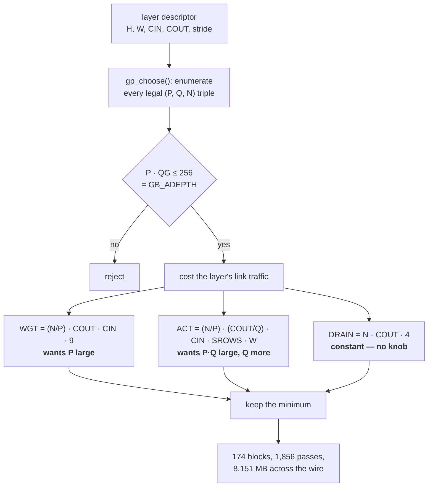

P and Q compete for one budget, so **the answer is a minimum rather than "as big as it fits"** — pushing P up to fill the accumulator array makes ACT worse faster than it makes WGT better. Drafting the table by hand produced two errors in eight rows, which is why `gp_choose()` exists; `firmware/test_gemm_plan.c` then asserts on the laptop that the chosen blocking tiles every tensor exactly once.

The predicted 8.151 MB is also what the board moved, to the byte: ACT 1.757 MB, WGT 2.219, RUN 2.778 (idle bytes — the tile computing), DRAIN 1.368, framing 0.029.

## One frame, in order

A frame is four nested loops. From the outside in: **8 layers → 174 blocks → 1,856 passes → 6,264 transactions.** A *transaction* is one framed command sent down the link plus the reply that comes back on the return line, and four of the six commands do real work:

| | direction | what it moves |
|---|---|---|
| `ACT` | host → tile | one activation **strip** — the rectangle of input rows this pass needs, cut out of the layer's input tensor and copied into the tile's `strip[]` buffer |
| `WGT` | host → tile | one weight stream, into `wbuf[]` |
| `RUN` | **neither** | idle bytes, clocking the tile through its **sweep** — the fixed number of clock cycles the tile needs to walk every output position against every weight. The tile has no oscillator of its own, so those cycles have to be *supplied*, and shifting a byte out is how the MCU supplies eight of them |
| `DRAIN` | tile → host | the int32 accumulators, on the 1-bit return line |

The other two are `CFG`, which hands the tile a block's 20 bytes of geometry, and `NOP`, which reads the status byte. Each block is `NOP`, `CFG`, then `npass` × (`ACT`, `WGT`, `RUN`), then `DRAIN`, then `NOP` — **4 + 3·npass** transactions. [One block on the wire](#one-block-on-the-wire) draws the sequence; [the link](#the-link) has the bits.

`npass` is not a tuning knob. It is `CIN / Cb` (`gemm_block.c:42`): one pass carries `Cb` input channels, the accumulator holds the partial sums between passes, and `DRAIN` reads them out once at the end. So the loop counts fall straight out of the blocking `gp_choose()` picked:

| layer | shape | stride | `Cb` | blocks | `npass` | ACT/WGT/RUN |
|---|---|---|---|---|---|---|
| 0 | 128×128×3 → 32 | 2 | 3 | 64 | 1 | 64 |
| 1 | 64×64×32 → 64 | 2 | 4 | 32 | 8 | 256 |
| 2 | 32×32×64 → 64 | 1 | 8 | 32 | 8 | 256 |
| 3 | 32×32×64 → 128 | 2 | 4 | 16 | 16 | 256 |
| 4 | 16×16×128 → 128 | 1 | 8 | 16 | 16 | 256 |
| 5 | 16×16×128 → 192 | 2 | 4 | 6 | 32 | 192 |
| 6 | 8×8×192 → 192 | 1 | 6 | 6 | 32 | 192 |
| 7 | 8×8×192 → 256 | 2 | **1** | 2 | **192** | 384 |
| | | | | **174** | | **1,856** |

**`conv7` is a fifth of the frame's passes on its own**, and the reason is the accumulator budget rather than its size. It is the smallest layer spatially — 8 × 8 in, 4 × 4 out — and the widest in channels. Covering `COUT = 256` in a sensible number of blocks wants `Q` large, `Q = 128` leaves only `P = 16`, and `P·QG = 256` is then already spent, so there is nothing left for `Cb`: one input channel per pass, 192 passes, twice over. Every row above spends the budget exactly, and **the pass count is what is left over after `P` and `Q` have taken theirs** — it is a consequence of the blocking, never a choice.

Then, in time:

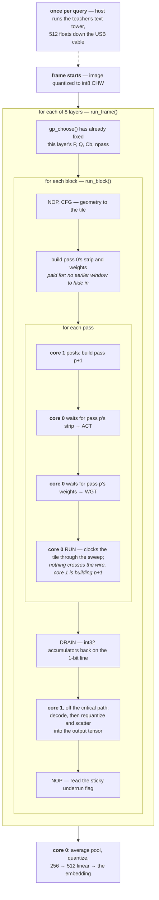

Three things about that order are the whole design, and each is measured elsewhere in this document.

**The pass loop is a software pipeline.** Core 0 never builds anything it is about to send. It posts pass *p+1*'s strip and weight builds to core 1 *before* sending pass *p*, so by the time it needs them they are done — the build hides inside the previous pass's `RUN`, which is the longest window in the frame and carries no data. Only pass 0 of each block is paid for, because it has no earlier window to hide in: `m7.c:508` puts that at **174 of the 1,856**, and the rest are free.

**Weight builds mostly do not happen.** [M7h](milestones.md#m7h--the-weight-gather-and-the-packers-round-trip--config-c-975--917-ms-and-a-saving-that-converted-at-40) keys a cache on the block's geometry, and it hit its arithmetic ceiling exactly — **847 of the 1,856 passes, 43% of bytes**, served without rebuilding, identically in all six modes and both link configurations, which is the fraction the arithmetic said was reusable and not one pass more.

**The scatter is deliberately late.** Nothing waits on a block's decode or its epilogue, so both go on core 1's low-priority ring and run in whatever gaps the build jobs leave. The output tensor only has to be complete before the *next layer* reads it, which is 174 blocks of slack in the worst case and one block in the best.

## One frame, 851 ms — *the 2026-08-03 split*

Same frame, priced. The bars are named after the four commands above. **This is the 851 ms frame, kept because it is the only per-actor breakdown that has been measured.** The inference frame is 350 ms now; `RUN` alone measured 118 rather than 313 at 280 MHz, and the clock has gone up again since, so the proportions below overstate the tile and understate everything that did not scale with the clock. Read it for which actor waits on which, not for the numbers.

```mermaid
gantt
    title Where 851 ms goes (aggregate per actor, NOT a chronological trace)
    dateFormat x
    axisFormat %L
    tickInterval 100millisecond
    section core 0
    wire — ACT / WGT / DRAIN transport   :active, a1, 0, 326ms
    wire — RUN, the tile computing       :crit,   a2, after a1, 313ms
    stage, locate, crc, decode           :        a3, after a2, 111ms
    stalled waiting on core 1            :done,   a4, after a3, 66ms
    section core 1
    weight builds + strips  (W1_HI)      :        b1, 0, 293ms
    DRAIN decode, scatter   (W1_LO)      :        b2, after b1, 216ms
    section measured
    frame                                :milestone, m1, 851, 0ms
```

Read the bars as totals, not as a timeline. Core 1's 509 ms runs *concurrently* with core 0's 639 ms of wire — that is the whole point of having it, and the 66 ms of stall is the part that did not fit. The four core-0 rows sum to **816 ms against 851 measured**; the 35 ms gap is per-layer scaffolding outside every profiling window.

| | ms | can it overlap anything? |
|---|---|---|
| wire, elapsed | **639** | it *is* the overlap — everything else hides here |
| core 0: `stage` + `locate` + `crc` + `decode` | 111 | no, it is between transactions |
| core 0: stalled on core 1 | 66 | no, by definition |
| *sum* | *816* | *vs 851 measured* |
| core 1: busy | 509 | yes — most of it hides in the wire's shadow; the 66 ms above is what did not |

### What each bar is

| bar | ms | what runs |
|---|---|---|
| `wire` — ACT / WGT / DRAIN | 326 | three DMA channels and a PIO state machine, armed to done |
| `wire` — RUN | 313 | the same machinery clocking a tile that is computing, not receiving |
| `stage` | 74 | `gw_stage()` — header, payload memcpy, clearing the idle tail |
| `locate` | 21 | `gw_locate()` — finding the response inside the capture |
| `crc` | 5 | the **outbound** CRC, on the DMA sniffer |
| `decode` | 11 | realign, inbound CRC, payload copy |
| stalled on core 1 | 66 | core 0 blocked in `w1_wait()` |
| weight builds | *293 combined* | `gb_weights()` — core 1, `W1_HI` |
| strips | *293 combined* | `gb_strip()` — core 1, `W1_HI` |
| DRAIN decode | 159 | the response half of the block — core 1, `W1_LO` |
| scatter | 57 | requantize and write out — core 1, `W1_LO` |

**`wire` is elapsed time, not bytes ÷ rate.** `prof.us_wire` is *"arm to done, so anything overlapped is inside it"* (`gemm_host.h:257`) — from the instant the three DMA channels are armed and the PIO SM enabled until all of them report done. Every scrap of CPU work scheduled inside that window is therefore counted inside this number too, and a window that *overruns* shows up as wire time the link never needed. Which is why [M7f-2](milestones.md#m7f-2--the-config-c-jumper-and-300-ms-that-arrived-as-zero)'s jumper removed 286 ms of wire and 0 ms of frame.

**`stage` builds the outgoing transaction in place** — header, payload, and an idle tail of zeros. The tail is *not* `memset`: [M7c](milestones.md#m7c--the-per-layer-sequencer--done-all-8-layers-bit-exact-2164-ms-per-frame) measured the naive version writing **4.35 MB of zeros a frame**, 2.778 MB of it RUN's sweep budget — bytes that are already zero, stay zero, and reach the tile as clock rather than as data. So a `dirty` high-water mark tracks how far past the header the buffer has ever been written, and only that much is cleared. It has to be exactly right rather than nearly right, because a stray non-zero byte in an idle tail is two bytes away from being a frame marker.

**`locate` exists because the link free-runs.** The reply is somewhere in a stream of captured bits at an unknown bit offset, so `gw_locate()` learns a delta per command class and checks there first. RUN needs its own slot: it holds the preamble in `R_WAIT` until the tile's `busy` has risen and fallen again (`gemm_link.v:487-521`), so its response position carries the sweep length — and its delta is *negative*, the response arriving before the idle tail ends. A wrong delta costs one failed 32-bit compare and a re-latch, so this may be slow but it cannot be wrong. [M7a](#the-link) took a block from 42 → 12 ms by replacing the linear scan; [M7g-2](milestones.md#m7g-2--the-reference-the-hint-slots-and-the-word-loop--config-c-1144--975-ms) took config C from 394 → 36 ms with per-class hint slots and a 64-bit word loop.

**`crc` is the outbound direction only**; the inbound one is inside `decode`. It is not a software loop — it is a third DMA channel snooping a memory-to-nowhere pass over the payload, ~11 µs on the longest one, concurrent with the wire itself. Which combination of (calc mode, output reverse, output invert) on the RP2354A's sniffer reproduces the reflected CRC-32 that `gemm_link.v` implements is **not guessed**: at boot the driver runs every plausible combination over two buffers of different length, neither a multiple of four, and keeps one only if it agrees with the software `gw_crc()` on both. If none does, software stays and the cost is the 268 ms it used to be. `decode` is the mirror: realign the response to a byte boundary, check its CRC, copy the payload out.

**The 127 ms stall is what two job rings did not manage to hide.** [M7f](milestones.md#m7f-1--the-drain-decode-and-what-one-fifo-cost) moved the DRAIN decode to core 1 and the frame fell 59 ms instead of the 157 the decode was worth — **101 ms came back as stall.** Core 1 was only 68% busy, so it was not out of capacity; it was serving in the wrong order. One FIFO put block *b*'s decode and scatter, which nothing is waiting for, in front of block *b+1*'s strip build, which core 0 blocks on ~240 µs later. Hence `W1_HI` (builds) drained ahead of `W1_LO` (decode, scatter), and 127 ms was the residue — **66 ms after M7i**, which halved `W1_LO` by making the epilogue two instructions instead of two calls.

**`weight builds` re-lay the weights into the order the tile reads them** — k-major, g-minor, lane-innermost, so the tile's word address is `k*QG + g` and it needs no multiplier. `gb_weights_slow()` stays compiled in as the oracle the fast version has to match. The 292 ms is what is left after M7h's cache absorbed 43% of the passes. **`strips` are the activation side**: `gb_strip()` cuts one pass's window out of the layer's full input tensor into `g->a_len` bytes. That tensor is stored **CHW** — channel-major, all of channel 0's pixels before any of channel 1's — which is why a strip is a contiguous run per channel rather than one rectangle.

**`scatter` is the epilogue the tile does not do.** The int32 accumulators come back in drain order — channel group outer, lane next, position inner — and each one is requantized and written to its place in the output tensor by `fgx_requant()` / `fgx_code()`, which are `encoder.h`'s, shared with the plain-C reference rather than copied, so there is exactly one epilogue in the project. [M7d](milestones.md#m7d--stop-serializing-the-cpu-against-the-wire--2164--1481-ms-firmware-only) found its inner loop computing `oc*OH*OW + (oy0 + pos/OW)*OW + pos%OW` — two integer divisions per output element, over 356,352 of them a frame — where `(pos/OW)*OW + pos%OW` is just `pos`. The division was never computing anything; it split a flat index apart so the next two terms could put it back together.

**M7i then halved what was left, and the whole saving was two library calls.** `fgx_code()` is `fgx_rint()` then `fgx_sat8()`; the rounding used `lrintf()`, which `arm-none-eabi-gcc` will not inline — `bl lrintf` is what comes out at `-O2` whether it is written as `lrintf()`, as `__builtin_lrintf()`, with `-fno-math-errno` or with `-ffast-math`, all four checked — and newlib's `lrintf` is ~30 instructions of exponent extraction and bit reassembly. `VCVTR.S32.F32` is one instruction and rounds by `FPSCR`'s mode, which is round-to-nearest-even out of reset and which nothing in the linked image ever writes (`grep -c 'vmsr.*fpscr'` is 0), so the substitution is exact rather than merely close. The clamp was a ternary — two compares and up to four branches — and `USAT` is one instruction with none. Written out at 356,352 calls a frame that is **141 → 57 ms of scatter**, and it also took the MCU-only baseline from 3,448 to 3,359 ms, since `encoder_fast` shares the same epilogue.

**313 of the 639 ms of wire is RUN, and RUN is not transport.** It is core 0 clocking the tile through its sweep with no data crossing in either direction: 159 MMAC / 8 MACs per clock / 75 MHz = **265 ms that overlaps nothing**, plus per-block FLUSH and setup. M10 closed on 2026-07-31 by synthesizing the tile on its own for the first time and measuring **70 MHz** standalone, against the 75 it is already clocked at — the worst path is a weight RAM output feeding a hard multiplier input at **logic level 0**, 5.264 + 2.716 = 7.98 ns before any routing, which caps this fabric at 125 MHz in principle. This paragraph used to close **"so the 313 ms has nowhere to go, and 851 ms is the bit-exact floor for the board"**, and it is kept in place because that was wrong in two independent ways. M16 pairs kernel taps so nine sweeps become six — *less to do*, not a faster clock. And the tile is clocked **by the link**, so `sys_clk` reaches it after all: the audits took the link to **140 MHz**, above the 125 that standalone number was read as a ceiling, and it is bit-exact there. `RUN` is **118 ms**. A worst-path figure bounds a *synthesis result*, not a board.

## The link

One transaction, byte by byte. Cells are bytes, not clocks; in configuration C each byte is 3 bits wide on the forward line and takes 8 link clocks coming back.

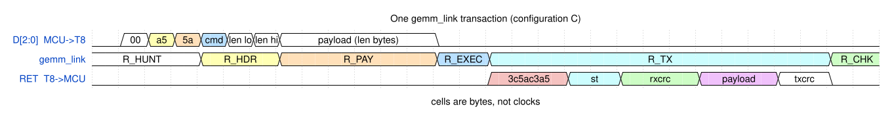

- **Forward, `D[2:0]`.** An optional `0x00` lead byte (`GW_LEAD` is 1 at width 3 and 0 at width 1) so the 6-byte prologue is a multiple of 3 and the payload lands word-aligned; then SYNC `0xa5 0x5a`, the command, and a 16-bit little- endian length. `R_HUNT` — the link's idle state, see [Two state machines](#two-state-machines) — makes the lead byte invisible: it hunts for the SYNC pair rather than counting from a start bit, so there is no framing to get wrong.
- **Commands.** `CFG 0x01` (20 bytes of geometry), `ACT 0x02`, `WGT 0x03`, `RUN 0x04`, `DRAIN 0x05`, `NOP 0x06`.
- **Back, `RET`.** A 32-bit preamble `0x3c5ac3a5`, a status byte, the CRC of what was received, the payload, and the CRC of what was sent. Both CRCs are CRC-32 with the reflected polynomial `0xedb88320`, seed `~0`, final XOR `~0` — the same function the MCU's DMA sniffer is *probed* against at boot rather than trusted from the datasheet.
- **The preamble is why the driver is O(1).** M6c spent 90% of the link idle because `find_preamble()` rescanned each capture from offset 0 while the answer sits at the end. M7a replaced that with a per-command-class offset hint, verified on every use: 42 → 12 ms per block.

### Pin budget

The netlist rules out the planned 8-bit bus: only 6 header pins reach the RP, 13 GPIO are unbonded, and the widest contiguous run anywhere is **3 bits (GPIO1–3)**. No jumper arrangement extends that.

What a jumper *can* do is move the clock out of those three bits. PIO takes `out_base`, `in_base` and `sideset_base` from independent registers, so the side-set clock can sit on any pin at all — and if it sits on a header pad jumpered across to the FPGA, all three contiguous GPIO become data.

**Configuration A — no board modification.** Everything on wiring that already exists.

| Signal | RP GPIO | FPGA ball | Notes |
|---|---|---|---|
| `LINK_CLK` | 2 | F3 `CCK` | PIO side-set. **Not a clock-capable ball** |
| `LINK_MOSI` | 3 | F2 `CDI0` | PIO `out`, 1 bit |
| `LINK_MISO` | 1 | G3 `SS_N` | PIO `in`, 1 bit |
| `LINK_FLAG` | 6 | A4 `NSTATUS` | free-running heartbeat |
| *(reserved)* | 4, 5 | G4, F4 | `CRESET_N` / `CDONE` — must stay config |

**Configuration C — one jumper, pad PIN2 ↔ pad PIN17.** Soldered on 2026-07-31 and the configuration every current number is measured in. Buys two things at once.

| Signal | RP GPIO | FPGA ball | Notes |
|---|---|---|---|
| `LINK_CLK` | 22 | B3 `CLK2` | via the jumper. **The only GCLK ball the RP can reach** |
| `LINK_D[2:0]` | 1, 2, 3 | G3, F3, F2 | PIO `out`, **3 bits** |
| `LINK_RET` | 6 | A4 `NSTATUS` | PIO `in`, 1 bit |

The return path is 1 bit in both cases and cannot be widened: GPIO5 is `CDONE` and GPIO7 has no pad, so GPIO6 has no contiguous neighbour. The link is asymmetric by construction — which suits an accelerator that is fed weights and activations and asked for a much smaller answer.

Either way the RP's six header pins (GPIO 8, 9, 12, 13, 22, 23) stay free for the **camera** — minus GPIO22 in configuration C — and the FPGA's 18 header pins stay free minus PIN17.

### Bus rate

Two instructions per bit puts the PIO ceiling at **half `sys_clk`** — a 75 MHz link at the stock 150 MHz, and 160 MHz at the 320 the appliance now boots to. Both columns below are the 150 MHz numbers, which is what every measurement in the table was taken at; scale them by 320/150 for the current operating point.

| | Forward (MCU→FPGA) | Return |
|---|---|---|
| Configuration A | 75 Mbit/s = **8.9 MB/s** | 8.9 MB/s |
| Configuration C | 225 Mbit/s = **26.8 MB/s** | 8.9 MB/s |

~~**These are ceilings computed from the PIO instruction count, not measurements.**~~ Both are now measured. **M2 measured configuration A at 8.94 MB/s each way with zero errors**, and M7f-2 soldered the jumper and moved **16.791 MB in 637 ms — 26.4 MB/s**, 1.6% under the computed ceiling, bit-exact at 75 MHz. The table was right to within rounding in both columns.

Even config C's 26.4 MB/s is short of the 50 MB/s the original 8-bit design assumed, which is why the dataflow keeps weights resident on the MCU and pushes whole layers rather than shuttling operands. That decision is now behind us and measured: the wire was 639 of 851 ms when that split was taken, and **half of that wire is the tile computing, not bytes moving** — which is why raising the link clock bought so much more than the byte rate alone predicted.

## One block on the wire

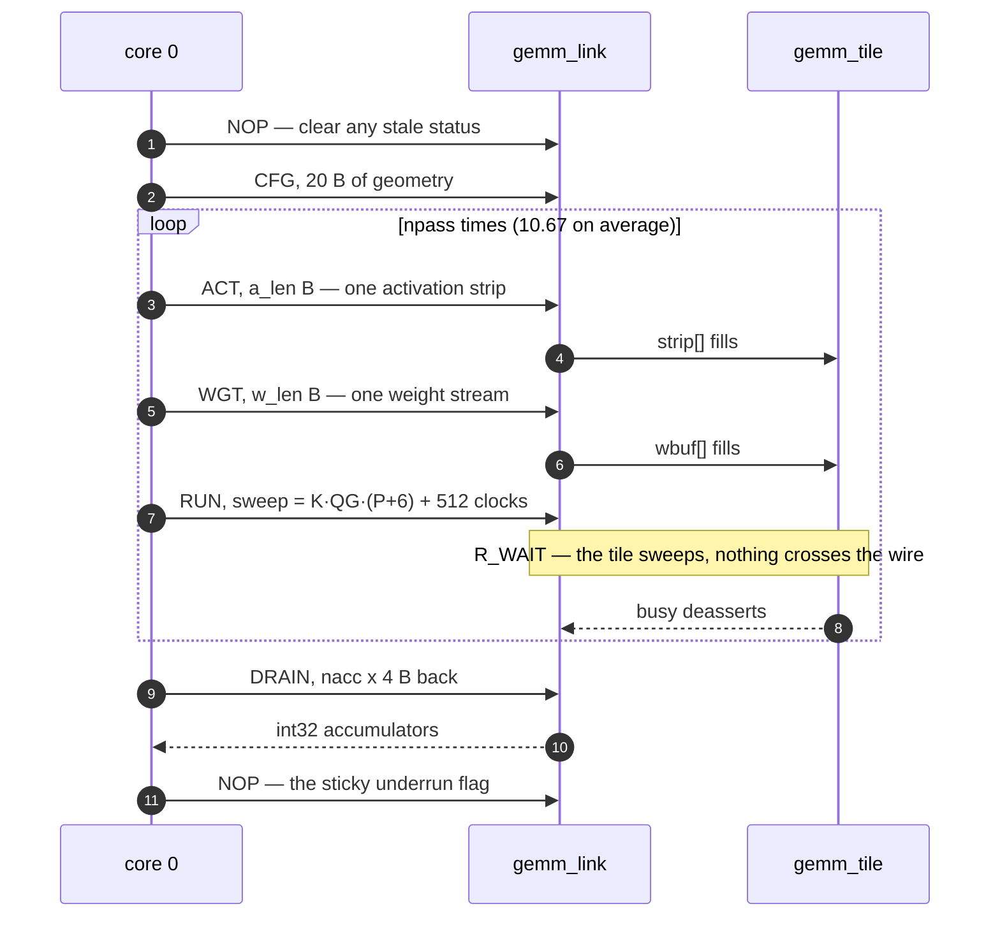

Each of the frame's 6,264 transactions is framed, hashed, captured and decoded, and that count is the reason M7g-1 put the per-transaction path in SRAM rather than leaving it on flash XIP.

**RUN is not what it looks like.** It carries no payload in either direction; its 2.778 MB is idle bytes clocked out while the tile sweeps, and that makes the largest single item in the byte census a thing that is not a transfer at all. WGT is more nearly what it looks like — the bytes really do cross — but the stream behind them is often [not built at all](#one-frame-in-order).

## Inside `gemm_top`

Three names in the figure are worth having first. A **lane** is one of the eight hard multipliers; all eight work on eight consecutive output channels at the same time, which is why `Q` is always a multiple of 8. A **tap** is one of the nine positions of a 3 × 3 kernel. `NMAC` is 8 — the lane count — and shows up as a width wherever the eight lanes are packed side by side.

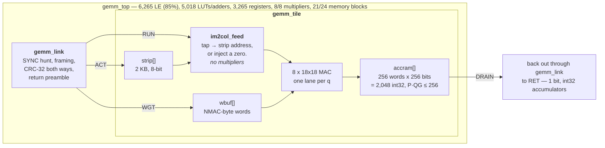

**`im2col_feed` is the reason the FPGA is worth using at all.** **im2col** is the standard way to turn a convolution into a matrix multiply: write out, for every output position, the nine input pixels its kernel touches, and the convolution becomes a plain GEMM over that expanded array. The catch is that a 3 × 3 kernel makes every input byte appear in up to **nine** of those columns, so the expanded array is 9× the input. Doing that expansion on the MCU and shipping the result spends the 9× on the link, which is the scarcest resource in the system. Doing it in the fabric — which is what `im2col_feed` is — spends it on BRAM reads, which are free. That is the difference between ~1.06 s and ~400 ms of wire per frame.

It has **no multipliers, and that is a requirement rather than an optimization**: all eight of the T8F49's are committed to the MAC array and there is no ninth. So the two products it would need are not computed there at all — `gemm_tile` walks the tap index as three nested counters and accumulates both bases with adders.

It also **injects zeros rather than skipping** out-of-range taps. `fgx_conv_ref()` in `firmware/encoder.c` skips them; adding zero and skipping are the same thing, including for the unsigned-input layers, so the datapath stays a fixed-latency pipeline with no stalls and stays bit-exact against the reference.

The three arrays are each as *wide* as they can be rather than split into banks, because Trion memory blocks are 5 Kbit with a bounded data width, so the cost is block count and not bit count. All eight MAC lanes share one accumulator address — the lane index *is* the low bits of q — so one 256-bit-wide array costs ~13 blocks where eight 32-bit arrays would each round up to 2 and cost 16. Memory is the tight resource here, not logic: **21 of 24 blocks against 33% of the LEs.**

## Two state machines

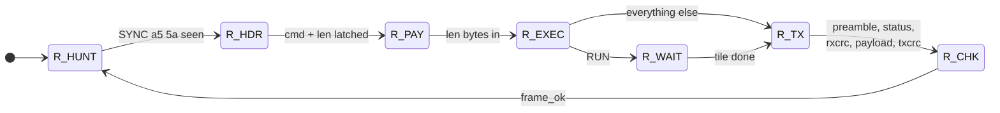

`gemm_link` starts in `R_HUNT` and returns there after every transaction, which is what makes the lead byte free and a mid-frame resync possible. `R_WAIT` is the state worth knowing about: it is where 314 ms of the frame is spent, and nothing is being transferred in it.

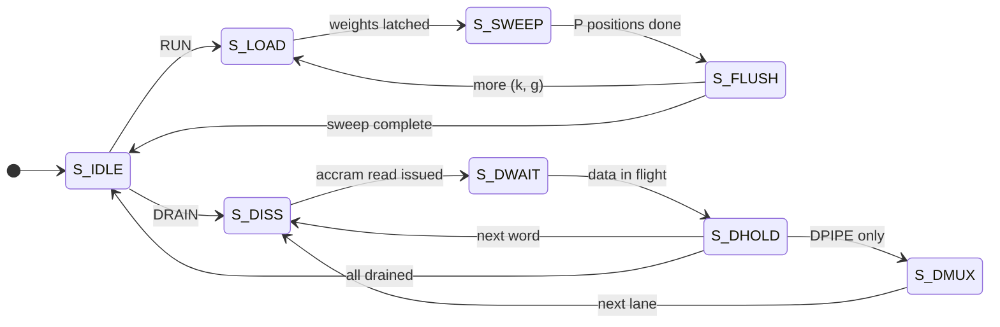

Per `(k, g)` the tile spends 1 clock in `S_LOAD`, P in `S_SWEEP` and `FLUSH = 5` in `S_FLUSH`, which is where `sweep = K·QG·(P+6) + 512` in the RUN command comes from. That budget is **clocks the MCU has to supply, not a timeout** — under-budgeting strands the tile mid-sweep, because `LINK_CLK` is the only clock it has.

## Two cores

Core 0 hands core 1 a job with `w1_post()` and gets back a **ticket** — an integer it can block on later with `w1_wait()`, if it turns out to need that job's output. Most jobs are never waited on, and the ones that are are the whole design problem.

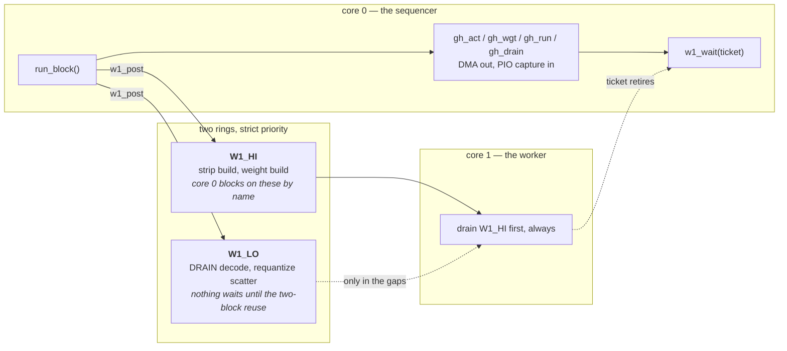

Until M7e this project used one of the RP2354A's two [Cortex-M33](https://developer.arm.com/Processors/Cortex-M33)s. Moving the builds and the scatter to the other one is worth 193 ms — not the 380 projected, because **work already hidden inside a DMA window costs nothing whichever core runs it**, so core 1's movable load was only what M7d had left exposed.

The two rings exist because one ring was measured and found wanting. M7f moved 157 ms of DRAIN decode to core 1 and the frame fell 59, because **101 ms came back as core-0 stall** with core 1 still 68% idle-capable: one FIFO put block *b*'s decode and scatter, which nothing waits for, ahead of block *b+1*'s build, which core 0 blocks on ~240 µs later. 101 ms over 174 blocks is 0.58 ms — exactly those two jobs. Splitting by *who waits* recovered 44 of the 101; the residual ~54 ms is a build waiting out a low-priority job already running, 0.16 ms measured against a 0.21 ms non-preemption bound, and not worth preempting.

One producer, one consumer, no locks: `head[]` is written only by core 0 and `tail[]` only by core 1, jobs are copied into the ring rather than referenced, and `firmware/worker.h` states all five rules in its header because **this is the first bug class in the project that a single strap does not settle.** *A strap*, used that way, was this project's unit of effort rather than a pin: short `PRG` to `GND`, replug the USB cable, copy a `.uf2`, watch what the board prints. For the first ten milestones every firmware change cost one physical trip to the bench, so "one strap settles it" meant a question a single such trip could answer — and that constraint is why the code below is shaped the way it is, even though **it stopped being true on 2026-08-03** ([question 9](history.md#verify-before-building)). The habits it produced are worth keeping regardless. Every mode is one binary A/B'd in the same boot, and every boot ends with an untimed sweep of all 174 blocks' accumulators — a *different binary* would itself be a perturbation.

Core 1 now runs **509 ms busy against 639 ms of wire**, and it is not the critical path: M7h took 211 ms off it and the frame moved 58. M7i took another 84 and the frame moved 66 — the difference being that M7h's saving was in `W1_HI`, which hides in the wire, and M7i's was in `W1_LO`, which was showing up as core 0's stall.

---

## Where the code lives

A plain tree of the repo is in [the README](../README.md#layout). This is the other half: the files where *knowing something about them* is part of understanding the design. If you read one thing here, read the first row.

### The reference, and the things checked against it

| file | why it matters |
|---|---|
| **`firmware/encoder.c`** | **THE REFERENCE.** The int8 encoder in plain C, bit-exact against numpy on the host and on silicon. Everything else in the project — `encoder_fast.c`, the RTL, the board — is *defined* as agreeing with it. **Do not tune it.** |
| `firmware/encoder_fast.c` | the same arithmetic as tiled im2col + blocked GEMM with an `SMLAD` inner loop: 7.4× `encoder.c`, byte-identical to it, and the MCU-alone baseline every speedup here is measured against — in the same boot, and in `m9`'s case at the same clock |
| `firmware/encoder.h` | `fgx_requant()` / `fgx_code()` live here, so the firmware and the reference share **one** epilogue rather than two that have to be kept equal |
| `firmware/dsp_shim.h` | the ACLE intrinsics emulated from the ARM ARM, so the `SMLAD` path is provable on a laptop before anyone walks to the bench |
| `firmware/gemm_block.c` | what one tile block looks like in host memory — strip, weight stream, golden accumulators. Linked by **both** the firmware and `gen_gemm_vec.c`, so `tb_gemm` checks the RTL against the code the MCU actually runs. `gb_weights_slow()` stays compiled in as the **oracle** the fast permutation is checked against: a wrong permutation is a plausible-looking tensor. Its `GB_HOT` macro sits behind a `GW_PICO` guard for the same reason: **this file must still build with a bare `cc`** (`gemm_block.c:12`), or the laptop-side half of the check goes away |
| `firmware/gemm_plan.c` | the blocking, swept from `desc[]` rather than tabulated. Hand-drafting it produced two errors in eight rows |
| `firmware/worker.h` | the two job rings, one producer, one consumer, no locks — **five rules in the header**, because this is the first bug class here that one trip to the bench does not settle |
| `firmware/frame.{c,h}` | one frame through the tile, extracted from `m7.c` so the harness and the demos share one engine. No `printf` and no `park()` in it: a library must not exit |

### The decision rule

| file | why it matters |
|---|---|
| **`firmware/m9.c`** | the demo firmware, and the whole of [the decision rule](#from-the-embedding-to-an-answer). Every constant in that section is defined here, next to the measurement that set it |
| `host/demo.py` | phrase → the teacher's text tower → 512 floats → USB. Holds the teacher resident, so `--ask` re-queries a **running** board. Builds contrast queries as `normalize(e_pos − mean(e_neg))`, which is why the feature needed no firmware. Sends in 512-byte chunks — see the comment on `CHUNK` for the deadlock 4096 caused |
| `host/cue.py` | the bench as an instrument: speaks scene changes on a schedule and records which frame each cue landed on. Its window placement is why 20-frame enrolment beats 1. `--frame-check` and `--preview N` keep a PNG of what the camera sees, and with `--enrol` a picture of each enrolment window is kept beside the log unasked — the 2026-08-17 run is why. Its live bars **mirror the board rather than re-deriving it**: once two classes are enrolled they switch from a softmax over the raw z to distance-to-each-reference in units of `sep`, filled the way the LED's brightness is, with the presence verdict taken verbatim from the board's `MATCH`. Before that they were the pre-#18 quantity and disagreed with the LED on the same frame |
| `host/cam.py` | renders a dumped frame. Writes **both** byte orders in full, because a byte-swapped frame still has a stable CRC and the only evidence of the order is the picture; `--preview PNG` is the one-path live mode the bench aims the camera with |
| `tools/score_cue.py` | scores a `cue.py` run against the boundaries it recorded, counting only from the frame the rule went live |
| `tools/score_drift.py` | measures what moves when nothing moves — the source of the "1.5 z over four minutes" that put drift in the common mode |
| `tools/probe_*.py` | offline probes on the teacher and the student, each carrying **its own results in its docstring**, so a stale one is visibly stale. `probe_rule.py` is the one the two-axis split came out of; `probe_sepscale.py` is the one that found `sep` was not a scale and set `FGX_ENROL_V`; `probe_multivisit.py` is the one that says the second visit is not worth having for accuracy alone; `probe_ceiling.py` is the one that says how much of a bench was decided before the decision rule ran |
| `host/caption.py` | the reverse direction — the board's 512 floats read back in English by retrieval against COCO. It centres on the bank's mean direction first, and has to: that mean has norm **0.738** (`caption.py:81-95`), so about three quarters of any embedding is the same vector, and uncentred **one hub image is the nearest neighbour of nearly every query** while the output still looks plausible |
| `ab.sh` | one A/B scene experiment from two phrases — the standard way a rule change gets benched |

### The model, and the space it emits into

| file | why it matters |
|---|---|
| `model/spaces.py` | **which embedding space a student emits into, resolved from one string.** Two 512-d spaces exist since M18 and a query encoded by the wrong teacher produces a well-formed number that means nothing — no exception, no NaN. This file, `export.json` and the board's weight crc32 are the three places that guard it |
| `model/distill.py` / `student.py` | the distillation and the 1.40 M-parameter CNN |
| `model/export.py` | folds batch norm into the weights and precomputes `bias`/`mult`, so nothing at runtime knows a scale |
| `tools/teacher_swap.py` | re-encodes a split's targets with SigLIP 2 SO400M through a frozen PCA to 512 — the M18 recipe |

### The fabric

`rtl/README.md` covers the Efinity flow. Three things about the sources are design rather than flow: `im2col_feed.v` has **no multipliers**, which is a requirement and not an optimization (all eight of the T8F49's are committed to the MAC array); `gemm_tile.v`'s accumulator is one 256-bit-wide array rather than eight 32-bit ones, because Trion memory blocks cost by the block and not by the bit; and `rtl/bitstreams/` holds the images **actually verified on hardware**, one directory per milestone, checked in because a P&R seed does not carry across netlists — a rebuild at the recorded settings is not guaranteed to give the same file back.

One tool there is load-bearing and easy to mistake for scaffolding: `rtl/mk_peri.py` writes the `.peri.xml` that place-and-route consumes, from the `.isf`. **Efinity only ships that step as a GUI**, and `efx_run.py` will not run the interface stage without a `.peri.xml` that already exists — so a project never opened in the GUI has a chicken-and-egg problem, and this script is the missing `DesignAPI.create()` half of it.